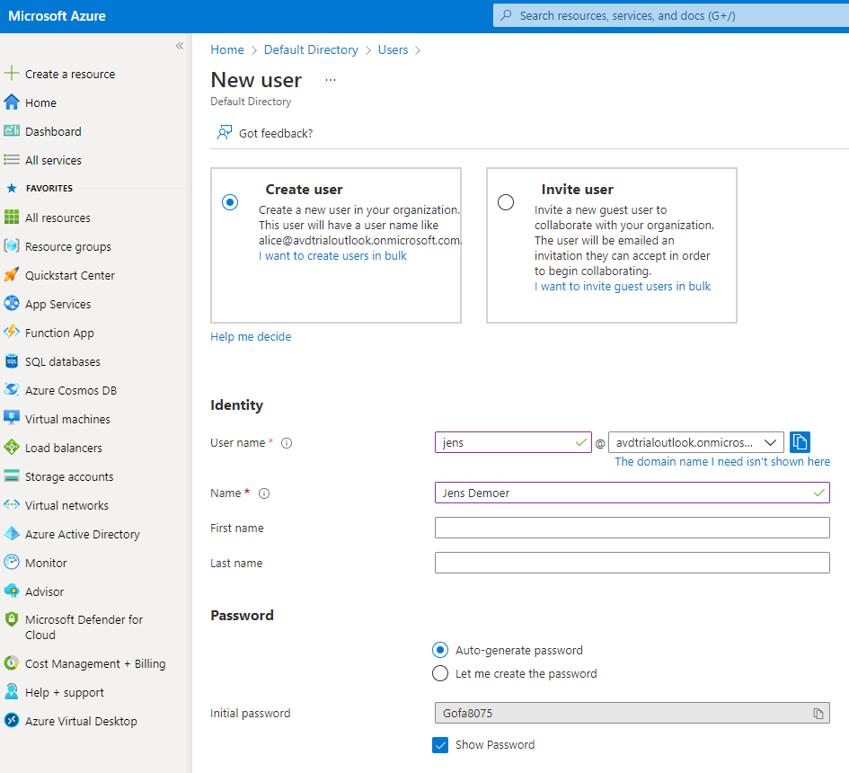
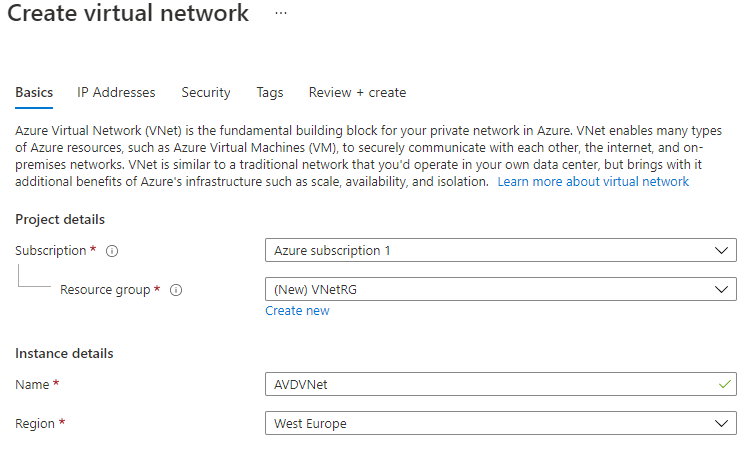
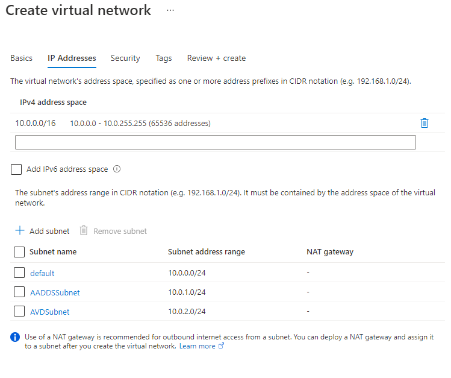
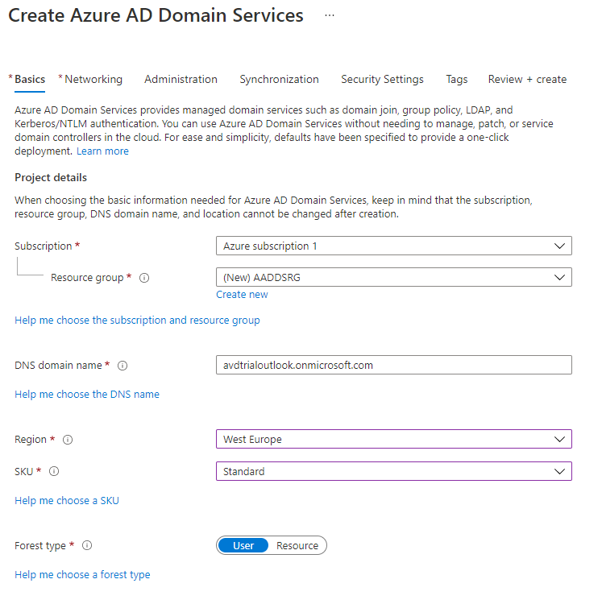
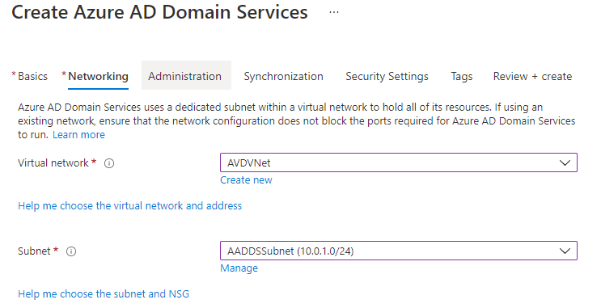
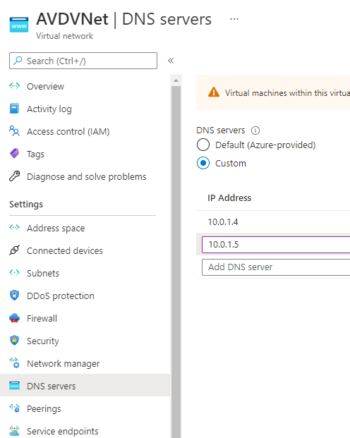

# Azure Trial 
As mentioned in the [Readme](../Readme.md), we recommend using your own Azure subscription with a separate Azure AD tenant.

If you can not provide this subscription, you can also use an [Azure Free Trial](https://azure.microsoft.com/en-us/free/) account to go through this Micro Hack. However, using this path has some limitations. For this reason, we still recommend to use your own full Azure subscription.

# Limitations
1. You must not use your corporate email address. Your corporate email is very likely assoicated with a corporate Azure AD tenant where you probably don't have the permissions required for this Micro Hack.
2. You can only create one Azure Free Trial per email address. So if you already used a trial in the past, you have to create a new email address 
(see [Step 1](#step1))
3. A trial subscription has a quota of only 4 vCPUs. If you want to try Windows Multisession with 2 VMs and see how FSLogix profiles stay with the user, you already use up all of these vCPUs. This means:
    - You cannot create an Active Directory Domain Controller and synchronize this Active Directory to Azure AD. Instead, you have to use Azure AD Domain Services (see [Step 4](#step4)) to create a synchronized Active Directory
    - If you want to create an Azure Virtual Machine for any purpose (as a jump host or to configure your session host image), you have to *delete* this VM before you create your AVD host pool. Otherwise, the host pool creation will fail with a "quota exceeded" error. Notice that stopped VMs still count towards your vCPU quota.
4. Depending on the data you enter and whether you have used Azure Trial subscription before, you may be rejected for an Azure Free Trial account. In this case, you still may use this guide, but then you need to select pay as you go pricing and pay for the Azure resources created.

# Requirements
To enable an Azure trial subscription, Microsoft requires you to validate your identity. For this reason, yopu need to provide the following during the sign-up process:
1. A valid mobile phone number
2. A valid credit card. This credit card will not be charged as long as you do not change the trial to a paid subscription. It is needed to prove your identity

## <a id="step1">Step 1: Create an outlook.com email address</a>
1. Open a new InPrivate tab in your web browser and navigate to [outlook.com](https://outlook.com)
2. Click on **Create Free Account**
3. Go through the sign up process
4. Validate that you can send and receive email through this address
5. (recommended) Create a new [Microsoft Edge Profile](https://blogs.windows.com/msedgedev/2020/04/30/automatic-profile-switching/) for your new outlook.com email address. If you just want to use this temporarily, do not configure Windows Hello and do not synchronize your data. Sign into outlook.com in this new Microsoft Edge profile and select "Stay signed in" when asked

## <a id="step2">Step 2: Create an Azure free trial</a>
1. Go to [Azure Free Trial](https://azure.microsoft.com/en-us/free/) and click on **Start Free**. Do not switch your Microsoft Edge profile when asked
2. Sign in with your outlook.com email address from Step 1
3. Fill out the sign up form. Be sure to specify a valid mobile phone number in local format. Click on **Text Me** and enter the validation code sent to your mobile. The Click **Verify**
4. Click on **I agree to the customer agreement and privacy agreement**, then click **Next**
5. Enter the credit card data needed for verification. This card won’t be charged unless you move to pay-as-you-go pricing.
6. You will either receive the information that your Free Trial is started or that you cannot use an Azure Free Trial. In the latter case, you can still sign up for pay-as-you-go pricing, but then you will need to pay for the resources you create.
7. Complete the Free Trial signup process

## <a id="step3">Step 3: Create user accounts</a>
1. Log in to [portal.azure.com](https://portal.azure.com)
2. (recommended) Go to the settings on the top right of the Azure portal: 
    - 
    - Set the language to English
    - Set the menu behavior to docked
3. Create 2 user accounts in **Azure Active Directory**
Navigate to Azure Active Directory -> Users. You should only see the account that created the subscription

Create a user in your directory. Write down the generated initial password:

Add another user after this. 

**Do not log in** with these users yet!

## <a id="step4">Step 4: Configure Azrue AD Domain Services</a>
1. Create a Virtual Network in the selected region. Name it **AVDVNet**

Keep the VNet IP range at **10.0.0.0/16**

Add 2 Subnets:

- **AADDSSubnet 10.0.1.0/24**

- **AVDSubnet 10.0.2.0/24**

2. Create Azure AD Domain Services
Click on **Create a resource** and type **Azure AD Domain Services**
Click on **Create**
Use the following settings:
- Resource group: Create a new one named **AADDSRG**
- DNS domain name: Keep the automativally filled one (should be like somethingoutlook.onmicrosoft.com)
- Region: The same you selected for the Virtual Network
- SKU: **Standard**
- Forest Type: User

Click **next**
- Virtual Network: Select **AVDVNet**
- Subnet: Select **AADDSSubnet**

Click **next**
- AAD DC Administrators: Click on **Manage Group Membership**. Select the first account that you created in step 3. The outlook.com account you are logged in would not work. 
- After this, click on the breadcrumb (top of white part of page) **Create Azure AD Domain Services** to get back to the wizard
- Click next until you reach the end of the wizard, then click **Create**

The creation of AADDS should take about 1 hour. After this, you need to wait for another hour until your Azure AD Domain Services Overview page no longer shows **Deploying**

## <a id="step5">Step 5: Change the Virtual Network DNS settings</a>
You need to change the DNS settings of your Virtual network to point to the domain controller IP addresses for Azure Active Directory Domain Services
1. In the Azure portal, go to your Azure AD Domain Services. Go to **Properties** and get the two values from IP addresses. They should be 10.0.1.4 and 10.0.1.5
2. Go to **AVDVNet** **DNS Servers**
3. Change to **Custom** and enter the 2 IP addresses from step 1 (one by one)
4. Click **Save**

## <a id="step6">Step 6: Change user passwords</a>
After deploying Azure AD Domain Services, in order to synchronize passwords, you need to change the passwords of all synchronized users. So in our case, these are the 2 users created in [step 3](#step3). 
1. Open an InPrivate tab in your browser
2. Go to [myapps.microsoft.com](https://myapps.microsoft.com)
3. Log in with the first account you created in step 3 (user name can be found under **User principal name** in the Azure Active Directory Users list)
4. Change the password to a new one
5. Repeat steps 1-4 for the other user

## Next Steps
You are now ready to deploy Azure Virtual Desktop

When you are asked to join an Active Directory domain, use the following data:
- Domain name: same as your Azure ad domain name (somethingoutlook.onmicrosoft.com)
- User for joining the domain: The first user you created in step 3 (the one you added to Azure AD administrators) with it's new password

In challenge 3 (FSLogix), you have to apply the steps from [this guide](https://docs.microsoft.com/en-us/azure/virtual-desktop/create-profile-container-adds)